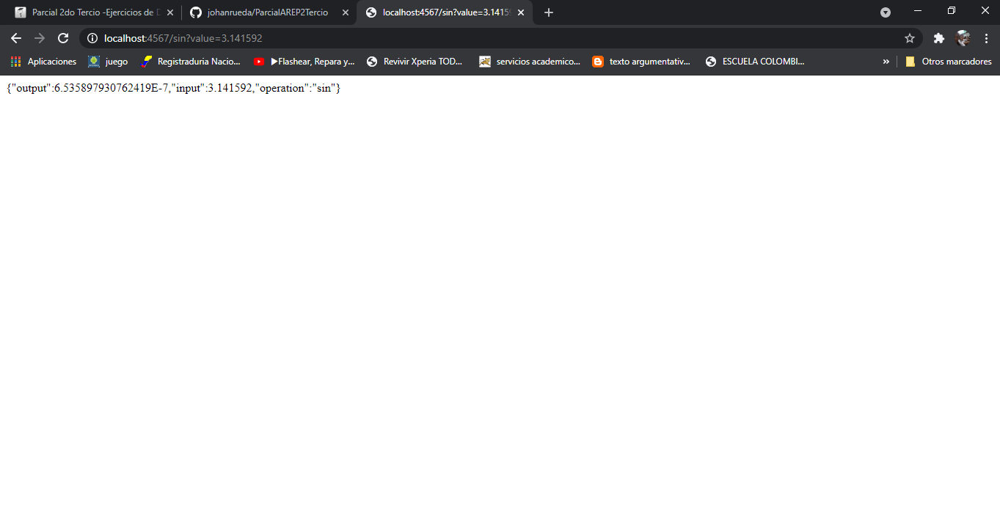
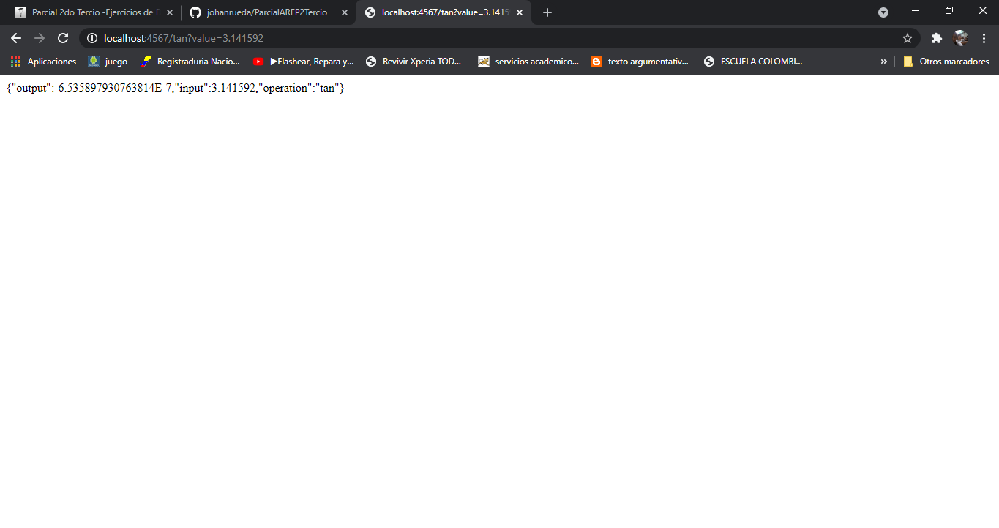
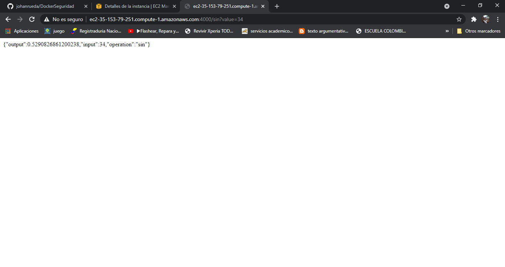

# Parcial 2 Corte AREP

Este parcial tiene como funcionalidad dar un servicio de calculadora con las funciones seno y tangente, recibiendo el tipo de operacion y su valor en la url, donde tambien esta desplago en una instancia de AWS.

## Prerequisitos del sistema
* Maven
* Git
* Java
* Docker

## Descarga,instalacion y ejecución
Primero debemos clonar el repositorio, como veremos en el siguiente comando:

**git clone https://github.com/johanrueda/ParcialAREP2Tercio**

Ahora ejecutamos una consola de comandos en el directorio donde fue clonado el repositorio y compilar el proyecto con el siguiente comando:

**mvn package**

**mvn test**

## Como funciona

Para ejecutarlo localmente 

java -cp target/parcial2TercioAREP-1.0-SNAPSHOT.jar edu.escuelaing.arem.app.App

y en el navegador de nuestra preferencia damos url

http://localhost:4567/sin?value=12

ó

http://localhost:4567/cos?value=12

## Documentación

Para generar la documentación de Java Doc ejecute el siguiente comando:

**mvn javadoc:javadoc**

Este proyecto se desarrollo con:
* Maven
* Java 8
* Intellij IDEA
* Docker

## Pruebas

Esta es la funcion seno:

y esta es la funcion tangente:

## AWS EC2

para la instancia en AWS vemos que el servicio ya nos esta corriendo

instancia de aws, donde la podemos utilizar con la funcion de sin o tan:

http://ec2-35-153-79-251.compute-1.amazonaws.com:4000/sin?value=34

http://ec2-35-153-79-251.compute-1.amazonaws.com:4000/tan?value=34

## Autor

**Johan David Rueda Rodriguez**

## Licencia
Este proyecto lo contiene la licencia GNU GENERAL PUBLIC LICENSE.
